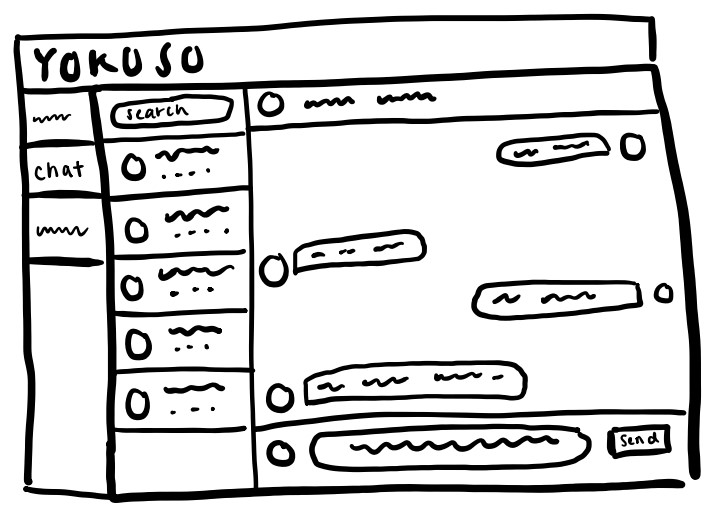

# SEG4105 Playground

## Synopsis

SEG4105 Lab 4 Fat Marker

## Contributor

Megan Hong 300012546

---

## Lab Activity

### Fat Marker Summary

This fat marker diagram is for a feature on my group's capstone project called Yokoso.

Currently our project is missing an easy way for tenants and landlords to connect with each other to inquire about rental opportunities. This is an issue as potential tenants might have questions about listings that aren't answered in postings by the landlord.

The image below is a fat marker diagram for a potential solution to the needed messaging application for Yokoso. This will provide a easy to access chat application within the website that would allow tenants and landlords to communicate with each other. Also, it will help keep track and display all other conversations that the users have on the side bar. This layout is a very similar UI to other websites, allowing it to be easy to use by users of different levels of technology experience.

### Fat Marker Diagram

