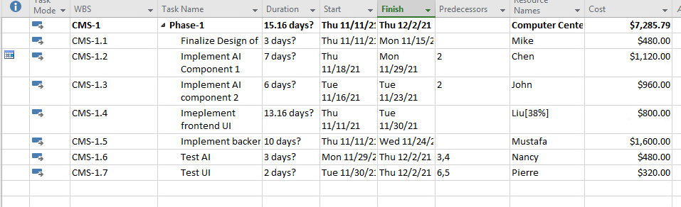
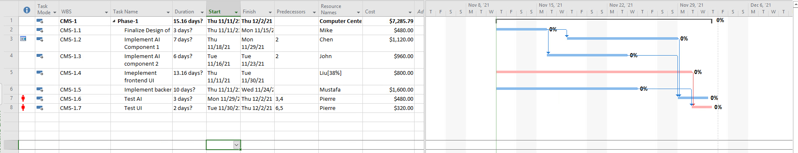
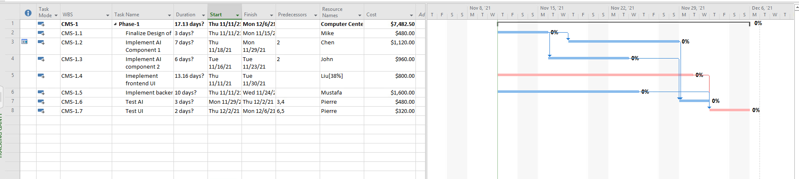

# SEG4105 Playground

## Synopsis

SEG4105 Lab 8 MS Project

## Contributor

Megan Hong 300012546

---

## Lab Activity

### Gantt Chart and Schedule (Task 1)

The cost of the phase is shown in the figure below:

The estimated total cost of Phase 1 is $13,045.79

### Gantt Chart and Schedule (Task 2)

### Analysis (Task 3)

After allocating Pierre to both "Test UI" and "Test AI", there can be seen that a resource allocation issue occurred. This is indicated on the task sheet on figure E, as there is a red person icon to the left of task CMS-1.6 and CMS-1.7. The icon indicates that the issue is an resource over allocation, as the Gantt Chart shows that Pierre must work on two tasks simultaneously which means that his workload exceeds his working hours.

The way to solve this resource over allocation issue is by resource levelling. This is the process of making sure that the task scheduling does not exceed the available resources. This resource levelling may cause the critical path to change, increasing the total number of days to complete Phase 1. Resource levelling is crucial as it ensure that project date estimation is realistic as scheduling follows the set constraints and expectations of the workplace. Also it doesn't over assume capabilities and resource availability.

In figure F, it shows the project after applying resource levelling. It can be seen that the days for task CMS-1.7 now starts after CMS-1.6, increasing the phase 1 project days from 15.16 to 17.13. The critical path remains the same, as it is CMS-1.4 --> CMS-1.7

### Deliverables (Task 4)

If iterations are three weeks long, in the current iteration for the scenario where Nancy is working on task "Test AI", all the tasks will be delivered within the first iteration (3 weeks)

In the scenario where Pierre is working on the tasks "Test AI" and "Test UI", the tasks that will delivered are:

- Finalize Design of AI Engine
- Implement AI Component 1
- Implement AI Component 2
- Implement frontend UI
- Implement backend
- Test AI

The remaining task "Test UI" will be delivered in the next iteration.
