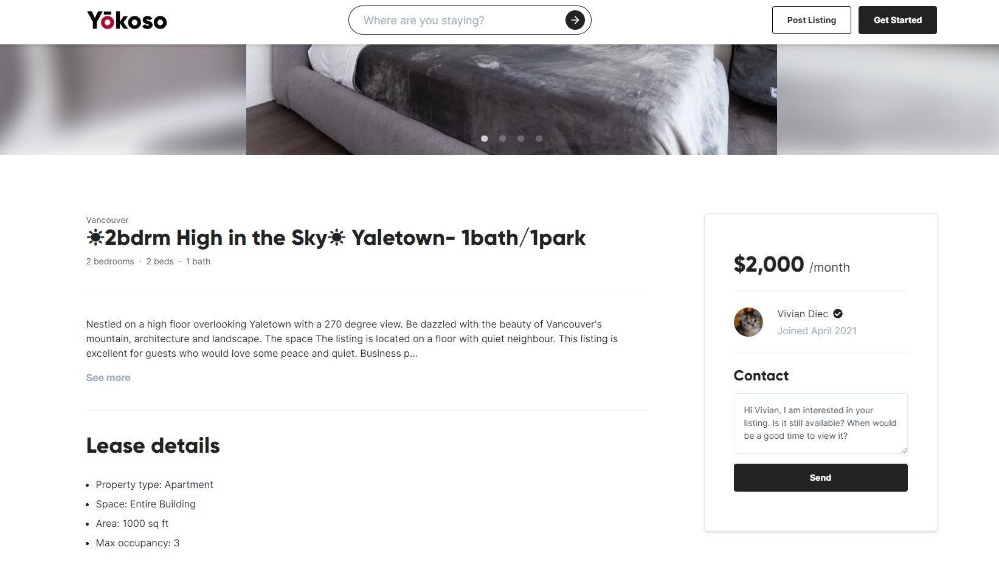
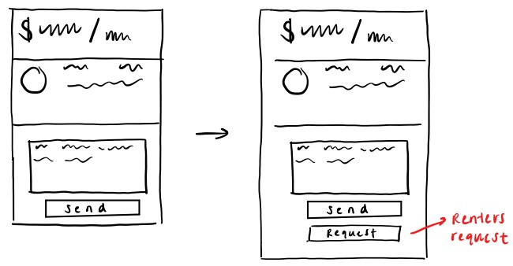
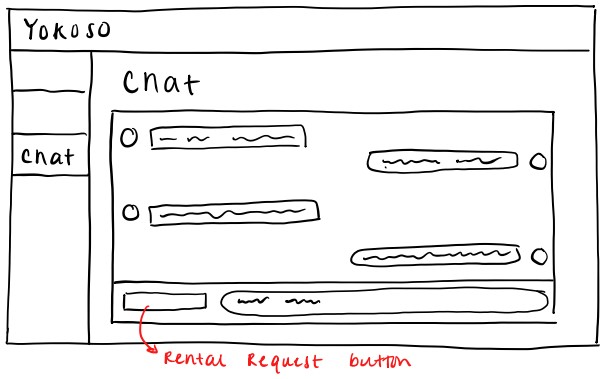
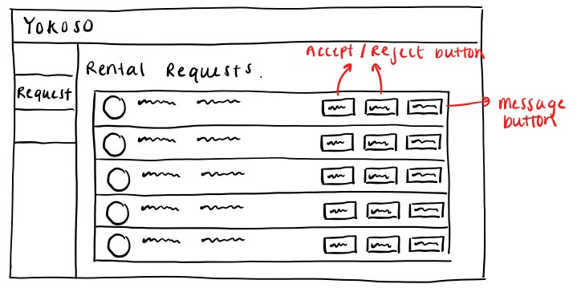
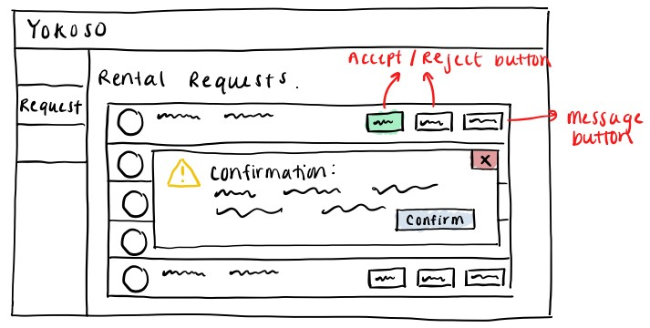
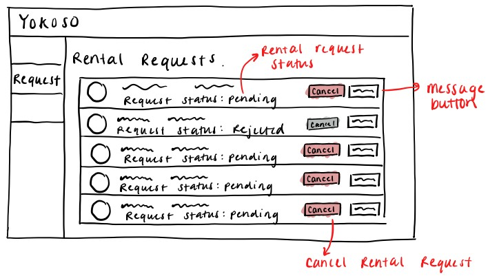

# Deliverable 1: Pitch

## Problem

Landlords posting properties need a clear indication on which renters are interested in renting their units. Typically, when renters are interested in rental listings they would send a message or email, indicating their desire to rent. For landlords, this is difficult as they get several messages inquiring about the same property, with many expressing interest in renting, but very few following through with it. This causes confusion and frustration for landlords, as they struggle to figure out which inquiries are serious rental requests and the large volume of messages can result in them missing out on potential renters

Currently on Yokoso if a renter is interested in a listing, they would message the landlord on the posting. The message will end up in a generic message inbox that has it be manually searched for rental requests.

---

## Appetite

This issue seems to be a universal struggle faced by landlords and users looking for rental units. Implementing a feature to fix this issue would help improve user flow and allow Yokoso to stand out compared to other web applications. This feature is estimated to take 3 weeks for a developer, as it may require creating new UI components and/or implementing new backend logic.

---

## Solution

### Renter Request Button

A potential solution to help relieve this pain point for landlords and renters, is implementing a renter request button. The renter request button will allow users to indicate to landlords their intentions to rent the listing that they're viewing.

There will be two main locations for the rental request button:

1. A request button can be added to the listings page, which will indicate to landlords that they are interested in moving forward in renting the property
2. Rental request button is also placed in the chat box between a renter and a landlord for easy access, when conversing.

When the **request** button is clicked, the rental request will appear on both the corresponding landlord’s and renter’s request dashboard.

Landlords will be able to manage all of the interested renters on a renter request page, which will allow them to accept and reject renter applications, or message renters for more information. Each rental request should indicate which listing it's associated with and the date the request was sent in.

If the landlord clicks **accept** or **reject**, it should display a validation modal asking to confirm the intentions of the landlord.

Once the confirmation is accepted, the action of the landlord are reflected on both the landlord's and renter's dashboard. If the landlord accepted a renter for a specific listing, it should reject any open rental requests for that listing.

Renters should be able to view and manage all of their rental requests. This page should show their rental request status and allow the user to cancel their request if it's no longer valid. If the rental request is cancelled, this should also be reflected on the landlord’s rental request page.

---

## Rabbit Holes

This implementation seems to be the best for this problem, as it requires minimal UI changes to the existing web pages. Also, majority of the user flow remains the same, and the flow that is added when making a request is straight forward, allowing for minimal confusion and difficulty by new users.

Some questions that might arise during implementation that can be answered are:

- How should the rental requests be organized on the dashboard for both the renter and landlord?

  - Renter: I think the renter's requests should be ordered by date of the rental requests, putting most recent requests at the top.
  - Landlord: The requests should be grouped by listings and they should be ordered by date, with the most recent at the top of the group

- What happens if a landlord tries to accept a cancelled listing (Cancelled before dashboard could update)?

  - An error message should appear on the landlord's side indicating that request is no longer available

---

## No Gos

- Once a landlord accepts or rejects (and confirms) a rental request, they cannot undo their action
- once a renter has cancelled their rental request, they cannot undo that action
